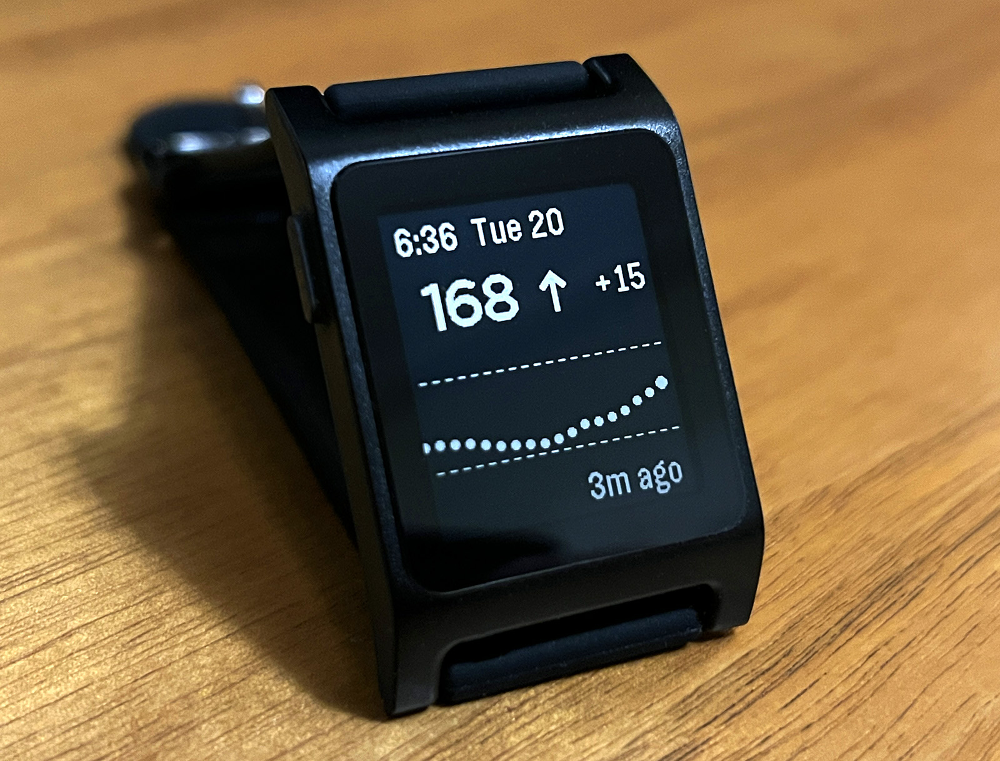
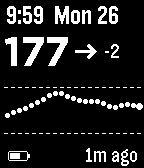
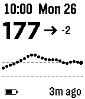

# T1000

A Pebble watchface that displays real-time Dexcom CGM glucose data and provides configurable High and Low Soon alerts. This is a port of the software written for the [custom T1D smartwatch project](https://andrewchilds.com/posts/building-a-t1d-smartwatch-from-scratch).



## Features

 

- Current glucose value with trend arrow
- Delta (rate of change)
- Time since last reading
- 2 hour CGM history
- Color-coded chart on Pebble Time (green/orange/red for in-range/high/low)
- Supports mg/dL and mmol/L
- Configurable high/low threshold lines
- Configurable high/low alerts
- Shows an alert icon if the watchface loses connection with the iOS companion app.

## Requirements

- Pebble / Pebble 2 (Aplite)
- Pebble Time / Time Steel (Basalt) (Untested)
- Dexcom CGM with Share enabled
- Dexcom Share account credentials

## Installation Instructions

Install from the Rebble app store:
https://apps.rebble.io/en_US/application/6972fd68ae32660009f7c242

## Building

```sh
npm install
pebble clean && pebble build && pebble install --cloudpebble --logs
```

Build and install locally:

```sh
npm run sideload
```

## License

MIT
